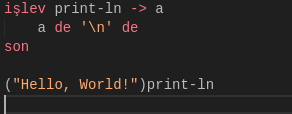

# tr-lang

tr-lang is the official extension for tr-lang programming language. It includes snippets and syntax highligthing.

## Features

### Syntax Highlighting

<small>Theme Credits go to [Min Theme](https://marketplace.visualstudio.com/items?itemName=miguelsolorio.min-theme) by [Miguel Solorio](https://marketplace.visualstudio.com/publishers/miguelsolorio)</small>

Describe specific features of your extension including screenshots of your extension in action. Image paths are relative to this README file.

For example if there is an image subfolder under your extension project workspace:

\!\[feature X\]\(images/feature-x.png\)

> Tip: Many popular extensions utilize animations. This is an excellent way to show off your extension! We recommend short, focused animations that are easy to follow.

## Release Notes

### [0.0.2] - 2021-12-27

- Some snippets for tr-lang

### [0.0.1] - 2021-12-26

- Initial release
- Syntax highlighting for tr-lang
