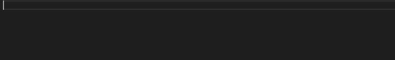

# tr-lang

tr-lang is the official extension for tr-lang programming language. It includes snippets and syntax highligthing.

## Features

### Syntax Highlighting

### Snippets

- <small>Theme Credits go to [Min Theme](https://marketplace.visualstudio.com/items?itemName=miguelsolorio.min-theme) by [Miguel Solorio](https://marketplace.visualstudio.com/publishers/miguelsolorio)</small>

## Release Notes

### [0.0.2] - 2021-12-27

- Some snippets for tr-lang

### [0.0.1] - 2021-12-26

- Initial release
- Syntax highlighting for tr-lang
